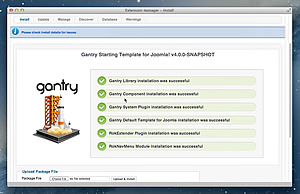
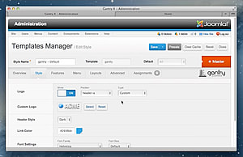
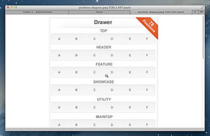
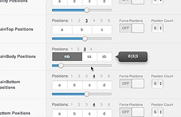
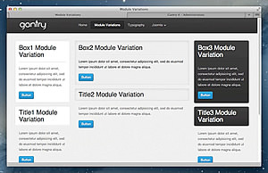
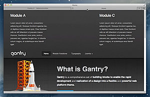
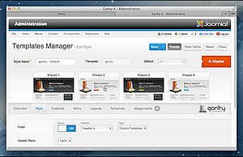
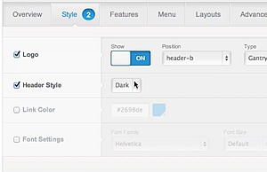

> 
>
> ## Gantry 4 Introductory Video ##
> This short 3 minute screencast will give you a taste of the power and flexibility of the Gantry framework for Joomla. The short videos below expand on many of these key features.

* 

  Gantry Installation

* 

  Gantry Features

* 

  Module Positions

* 

  Module Widths

* 

  Module Variations

* 

  Force Module Positions

* 

  Custom Presets

* 

  Template Overrides
