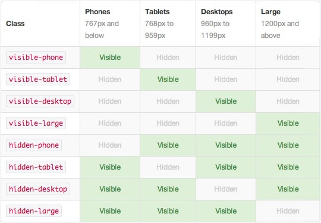
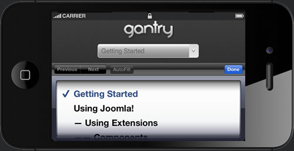

Responsive Grid System
======================
The Gantry Framework was originally based on the [960 Grid System](http://960.gs/) that offered a 12 column grid structure based on a fixed 960px wide layout. From version 4.x onwards, the responsive grid system of [Twitter's Bootstrap](http://twitter.github.com/bootstrap/) is now being used.

> 
>
> Check out the Gantry introductory video to see the responsive capabilities of Gantry 4 powered template designs. Powerful features, presets, layout configuration, responsive design, and much, much more.

The **Responsive Layout** adapts to the viewing device, such as a smartphone, tablet or desktop, based on the resolution of the screen. There are five different width formats, and each utilises the grid structure in a different way, as to be outlined. This is achieved through **@media queries** which can detect the width of the browser window, and allows for different CSS accordingly. This is the basic function that makes responsive designs possible. In effect, a single site will adapt automatically to the viewing device, without the need for separate layouts, such as for mobile.

As a note, a responsive layout does not detect a specific device, it only detects the width of the viewing environment, so any names such as _smartphone_ or _tablet_ are convenient shorthand only.

Responsive Grid Info
--------------------
The responsive grid system is designed for desktop, tablet and smartphone systems, each with minor modifications to ensure compatibility in each mode. The table below shows the breakdown of screen resolutions and associated devices, and what layout characters are then applied to each.

Responsive Support Classes
--------------------------
Another useful available feature, via Bootstrap, is the collection of responsive utility classes that can be used to help tweak layouts by providing a simple method of showing or hiding modules. Insert the below support classes into your module settings to show/hide a module for a particular mode, or add to a specific element in your content.

Media Queries
-------------
The actual media queries CSS looks like the following:

~~~ .css
/* Smartphones */
@media (max-width: 480px) { ... }

/* Smartphones to Tablets */
@media (min-width: 481px) and (max-width: 767px) { ... }

/* Tablets */
@media (min-width: 768px) and (max-width: 959px) { ... }

/* Desktop */
@media (min-width: 960px) and (max-width: 1199px) { ... }

/* Large Display */
@media (min-width: 1200px) { ... }
~~~

Navigation
----------
The menu system for a smartphone device will be that of a select-field. A select field is a great solution for this because most phones have nice native select UI elements. Using this method is necessary as to make the menu accessible on the mobile devices, as Fusion, and our other menu types, are simply too complex to render effectively on these devices. A new menu system will be created that is responsive, but will form part of Gantry

All other sizes will use the normal menu system build on RokNavMenu, such as Fusion Menu or SplitMenu.

