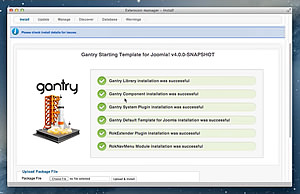
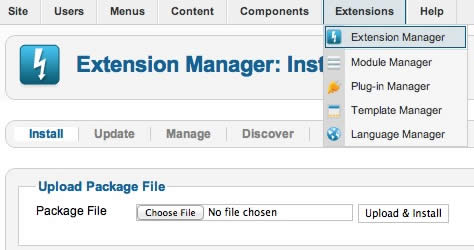
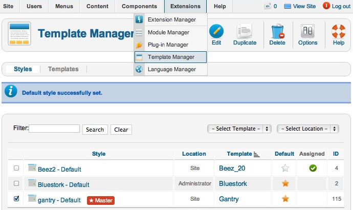

Installation
============

The Gantry framework itself is independent of any template. Each Gantry-enabled template relies on the Gantry framework to provide the underlying base and extensive functionality that enables the creation of such powerful sites.

> 
>
> A quick way to see the installation process in action is to watch this short screencast. It will provide a run-through of the steps required to quickly and easily get Gantry installed.

Downloading Gantry
------------------

Gantry has three available download types:

* __Bundle__: This includes the Framework (library, component & plugins), the Gantry template and associated extensions such as RokNavMenu.
* __Framework__: This contains only the Framework (library, component & plugins).
* __Template__: This contains just the Gantry template.

The installation process is exactly the same for all three. The only difference is the file you are installing. Select the download option best for you. We recommend the bundle for first-time installs.

[Download](http://www.gantry-framework.org/download#joomla25)

Installing Gantry
-----------------

Install at **Extensions → Extensions Manager → Install**. Select the **Choose File** button, locate the downloaded ZIP and click **Upload & Install** to begin the installation.

The Gantry template will appear in the **Template Manager**, the Gantry plugins will appear in the **Plugin Manager**, and RokNavMenu will be available from the **Module Manager** (Click **New** to create a new instance of RokNavMenu). The component/library will be hidden, and only accessible from the **Extensions Manager** for uninstallation/upgrading purposes.

Setting the Gantry Template as Default
--------------------------------------

If you are using the Gantry template, you will want to set it as the default template so it loads on the front end. Go to **Extensions → Template Manager**, select the **Gantry** checkbox, and click **Default** in the button toolbar.

