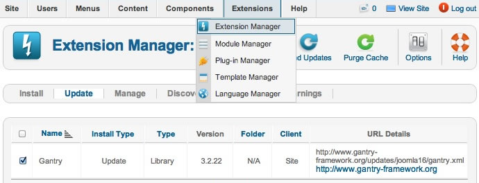

Upgrading
=========
There are several parts to Gantry: library, component, plugin and template; and have a similar upgrading process.

There are two methods of upgrading the Gantry Library, either via the Joomla Updater or through an overriding reinstall. The first is the simplest and recommended method. Go to **Extensions → Extensions Manager → Update**, select **Find Updates** to load all available updates, if not already shown. Then select Gantry and click **Update**.. Gantry will now be updated directly from the web.

The alternative method is one identical to installing Gantry, and necessary for upgrading the Gantry template. You would just need to download the latest [Gantry files][files], and install at **Extensions → Extensions Manager → Install**. Select the **Choose File** button, locate the downloaded ZIP and click **Upload & Install** to begin the update. There is no need to uninstall first as the files will be updated during the installation process.

You can check to see if the correct Gantry version has been installed by going to **Extensions → Extensions Manager → Manage**, then search for Gantry. The version number will appear in the table.

[files]: http://code.google.com/p/gantry-framework/downloads/list?can=3&q=platform%3DJoomla25
