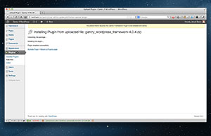
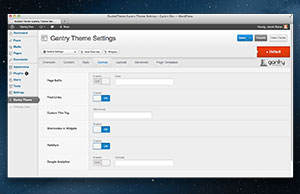
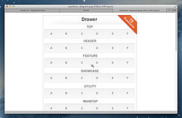
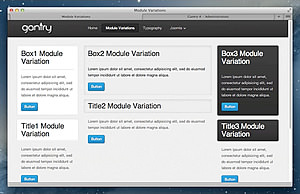
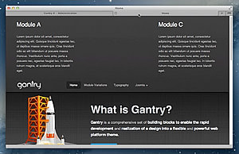
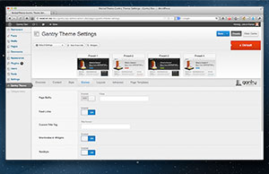
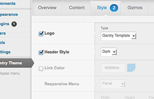

> 
>
> ## Gantry 4 Introductory Video ##
> This short 3 minute screencast will give you a taste of the power and flexibility of the Gantry framework for WordPress. The short videos below expand on many of these key features.

* 

  Gantry Installation

* 

  Gantry Gizmos

* 

  Widget Positions

* 

  Widget Widths

* 

  Widget Variations

* 

  Force Widget Positions

* 

  Custom Presets

* 

  Template Overrides
