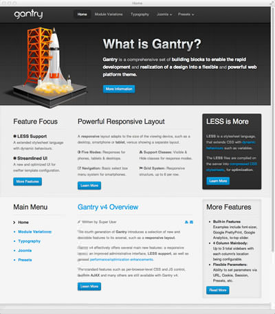
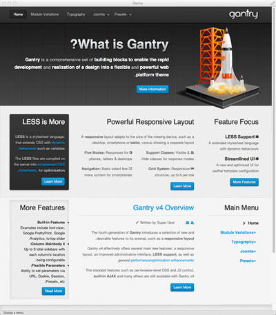

RTL Support and Limitations
===========================
RTL stands for “right-to-left” and this is a key component when delivering a website in an RTL language such as Hebrew, Arabic, Urdu, etc. Gantry has built in RTL support which will automatically “flip” the content layouts and ordering to support RTL. We’ve also provided an override in the advanced section of the theme details, so you can turn this default behavior off if you like. However, by default, if the language file supports it, RTL will be enabled.

You can force Wordpress that a language should be displayed in RTL format. In that case, there is a configuration file located:

`YOUR_SITE/wp-config.php`

Just edit the mentioned above file and add following code:

~~~ .php
$text_direction = 'rtl';
~~~

A visual example of how this looks/works can be seen below. The first image is in the default english in the traditional LTR format, while the second one is the same default english but with the forced RTL in the `wp-config.php` file.

|  |  |
|:-----------------------:|:-----------------------:|
| Left To Right           | Right To Left           |

RTL Limitations
---------------
Gantry provides a great deal of functionality to support RTL right out of the box. However, RTL is complicated and your specific layout will need extensive RTL support in your CSS files to properly handle the needs of your design when in RTL mode. For example if you have a widget header that is shaped like a ribbon that comes in on the left side of the widget in regular LTR mode, then you must create a special version of this ribbon that comes in from the right for RTL mode. Also you will have to provide the specific changes to the layout in your CSS file to ensure this image is rendered correctly.

To help out with this process we have created a special feature that detects the RTL mode, and then inserts a class called **rtl** in the body tag. That way you can add specific rules such as:

~~~ .css
body.rtl .widget .ribbon { float: right; }
~~~

to just target the .ribbon class in RTL mode.

Other limitations are entirely based on the browsers. Some browsers support RTL mode very well. Not surprisingly these are the mozilla and webkit based browsers: Firefox, Safari, Chrome, etc. Internet Explorer, even the latest version 9.0 release does a very poor job of rendering in RTL mode, and you will probably have to spend extensive time doing CSS work-arounds for these browsers. This is far beyond the scope of what Gantry can do for you.
