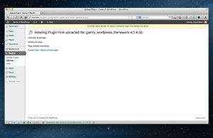
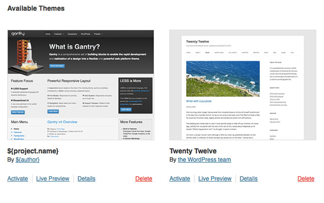

Installation
============
The Gantry framework itself is independent of any template. Each Gantry-enabled template relies on the Gantry framework as an underlying base which provides extensive functionality that enables the creation of powerful and flexible sites.

> 
>
> A quick way to see the installation process in action is to watch this short screencast. It will provide a run-through of the steps required to quickly and easily get Gantry installed.

Downloading Gantry
------------------
Gantry has three available download types:

* __Framework__: This contains only the Framework plugin.
* __Template__: This contains just the Gantry template.
* __RocketLauncher__: This includes the full WordPress installation, Framework (plugin) and the pre-configured Gantry template (only for NEW installations).

The package you choose to install makes a difference in terms of where you'll be installing the files. **Gantry Framework for WordPress** should be installed like a standard WordPress plugin. The **Gantry Default Theme for WordPress** should be installed the same way you would install any other theme. 

>> Keep in mind that you will need the Gantry framework installed for any Gantry themes to work.

If you don't have WordPress installed on your server yet, you can use the **RocketLauncher** package. It contains the full pre-configured Gantry environment, and is essentially a complete WordPress installation. Choose whichever download option is best for you. We recommend the **RocketLauncher** for first-time WordPress installations.

[Download](http://www.gantry-framework.org/download#wordpress)

Installing the Gantry Framework for WordPress
-----------------
To install the Gantry template, you'll need to navigate to **Plugins → Add New** in the admin area of WordPress. From here, select the **Browse** button, locate the downloaded ZIP file, and click **Install Now** to begin installation.

The Gantry template will appear in **Themes**, the Gantry plugins will appear in **Plugins**.

Activating the Gantry Theme for WordPress
--------------------------------------
If you are using the Gantry framework, you'll want to use a Gantry-compatible template. After uploading your template, simply go to the **Appearance → Themes** area in the admin area of WordPress and click **Activate** next to your template.

