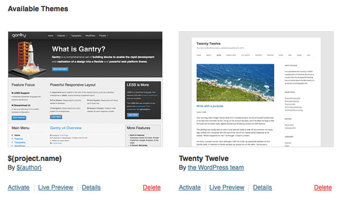
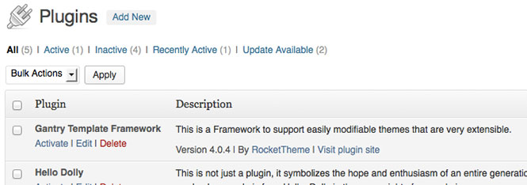

Uninstallation
==============
There are two main parts to Gantry, the framework and the template. Therefore, there are two parts to uninstalling. If you intend to uninstall only the template portion, then follow the instructions for removing the template only. Keeping the Gantry plugin installed really does not harm as it is only used by a Gantry-enabled template, but if you wish to uninstall the plugin, you can follow those steps also.

Unsetting the Gantry Template as Default
----------------------------------------
To uninstall the gantry template, you will first have to ensure that it's not activated. Go to **Appearance → Themes** and click on the **Activate** on any other template that is not gantry. After that you can simply click on the **Delete** button next to the Gantry template.

Uninstall Gantry
----------------
Uninstall the Gantry plugin and template from **Plugins** admin page. Please search for the Gantry Template Framework and **Deactivate** it firstly, then click **Delete** next to its name. Gantry will now be deleted.

