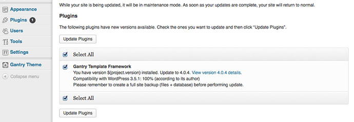

Upgrading
=========

There are two methods of upgrading the Gantry Framework plugin, either via the WordPress Updater or through an overriding files. The first is the simplest and recommended method. Go to **Admin Dashboard → Updates**, select **Check Again** to load all available updates, if not already shown. Then check the checkbox next to the Gantry Template Framework and click **Update Plugins**.. Gantry will now be updated directly from the web.

The alternative method is requiring you to upload the files via FTP. You would just need to download the latest [Gantry files][files], extract them and overwrite the whole `gantry` directory under `wp-content/plugins`. There is no need to uninstall first as the files will be overwritten durning the FTP upload.

You can check to see if the correct Gantry version has been installed by going to **Plugins**, then search for Gantry. The version number will appear in the table.

[files]: http://code.google.com/p/gantry-framework/downloads/list?can=3&q=platform%3DWordPress
