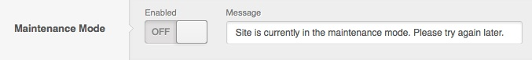
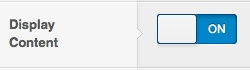
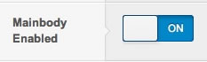
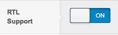
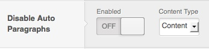
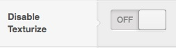
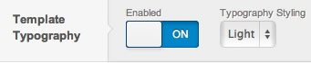
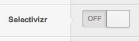
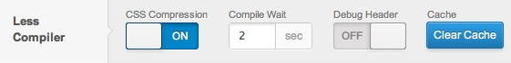

Advanced
========
The Advanced panel in the Gantry based template administration interface provides several options for configuring the advanced options for the template. The following configuration options are available:

Maintenance Mode
----------------
Maintenance Mode allows you to block the non logged in visitors from viewing your site for the time you're making changes to it. This way you can do modifications and test them without unnecessary rush. By default the front end will display the message specified in the **Message** field, but you can also create your own custom file called `maintenance.php` in the template root directory which will be used instead.

Display Content
---------------
The Display Content option allows you to enable/disable the output of the WordPress content on the frontend. This is useful for sites and templates that want to make use of a page that consists entirely of widgets but preserving all mainbody widget positions.

Mainbody Enabled
----------------
The Mainbody Enabled option allows you to enable/disable the entire mainbody section. This is useful for sites and templates that want to make use of a page that consists entirely of widgets.

RTL Support
-----------
RTL means “right-to-left” and is a key component when trying to deliver a website in an RTL language such as Hebrew, Arabic, Urdu, etc. Gantry has built in RTL support which will automatically “flip” the content layouts and ordering to support RTL. This option allows you to enable/disable the built-in RTL support which is automatically detected and displayed based on the language file setting.

Disable Auto Paragraphs
-----------------------
Disable Auto Paragraphs option allows you to remove the WordPress filter responsible for automatic `
` tag content wrapping. This can be very useful when creating a complex content.

Disable Texturize
-----------------
Disable Texturize option disables some text transformations like smart (curly) quotes, for content and comments. This can be very useful for example for placing code inside of your content.

Template Typography
-------------------
The Template Typography option allows you to enable/disable specific typography elements from loading, as well as allowing you to select between light and dark typography.

Selectivizr
-----------
Enable or disable Selectivizr support for IE8 providing support for additional CSS selectors for better compatibility.

Less Compiler
-------------
Less is used for all the CSS, which is a server side compiler. These options allow you to determine the delay on that compiling process, whether CSS compression is also infused within it and if you wish to debug the header. There is also a button to clear the LESS cache.

