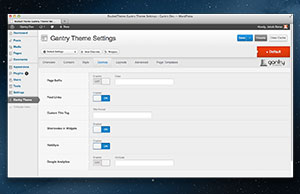

Gizmos
========

> 
>
> A quick way to see the power of Gantry gizmos is to check out this short screencast. It covers some of the basics of gizmos and how they work and how they can be easily integrated into your design.

Page Suffix
-----------
The Page Suffix gizmo allows you to add extra css classes to the `<body>` tag of your site. This allows you to apply your CSS styles on a per-page basis.

Feed Links
----------
The Feed Links gizmo decides wheter WordPress should add the feed links to the `<head>` tag allowing various feed readers to access them.

Custom Title Tag
----------------
The Custom Title Tag allows you to customize your sites `<title>` tag that would replace the default one in the head section. This combined with our Overrides system gives you a possibility to have a completely different site title for each element of your content. There are a number of tokens available for usage : 

**Front Page / Home Page**

* `%blog_title%` - displays the blog title (set in the WordPress Settings)
* `%blog_description%` - displays the blog description (set in the WordPress Settings)

**Static Page**

* `%blog_title%` - displays the blog title (set in the WordPress Settings)
* `%blog_description%` - displays the blog description (set in the WordPress Settings)
* `%page_title%` - displays the title of currently viewed page
* `%page_author_login%` - displays the login of the author of current page
* `%page_author_nicename%` - displays the nicename of the author of current page (set in the WordPress user settings)
* `%page_author_firstname%` - displays the first name of the author of current page
* `%page_author_lastname%` - displays the last name of the author of current page

**Category Pages**

* `%blog_title%` - displays the blog title (set in the WordPress Settings)
* `%blog_description%` - displays the blog description (set in the WordPress Settings)
* `%category_title%` - displays the title of the currently browsed category
* `%category_description%` - displays the description of the currently browsed category

**Archive Pages**

* `%blog_title%` - displays the blog title (set in the WordPress Settings)
* `%blog_description%` - displays the blog description (set in the WordPress Settings)
* `%date%` - displays the date of the currently browsed archive page

**Tags Pages**

* `%blog_title%` - displays the blog title (set in the WordPress Settings)
* `%blog_description%` - displays the blog description (set in the WordPress Settings)
* `%tag%` - displays the tag of the currently browsed tags page

Shortcodes in Widgets
---------------------
The Shortcodes in Widgets gizmo allows you to use WordPress shortcodes in Widgets. When disabled shortcodes syntax placed in widgets won't get parsed.

RokStyle
--------
The RokStyle gizmo allows you to easily add inline css or js code to the `<head>` tag of your site by placing a shortcode syntax in your content. Example of use : 

**CSS :** `[rokstyle type="css"].example {font-weight: bold;}[/rokstyle]`

**JavaScript :** `[rokstyle type="js"]InputsExclusion.push('.example')[/rokstyle]`

Google Analytics
----------------
The Google Analytics gizmo allows you to enable Google Analytics tracking on your site in a quick and easy way. Just enable the feature and input your UA Key assigned to you by Google in the field provided.

