Layouts
=======
The Layouts panel in the Gantry based template administration interface provides several options for configuring the layout of the template. Each widgetized section of the template design offers 6 widget positions by default

> [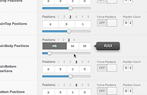](http://youtube.com/embed/g0iEalGwdJY)
>
> To find out about Layouts and Widget Widths, check out this quick screencast. It covers some of the basic concepts involved in understanding and configuring layout with a combination of widget configuration and Gantry layout control.

Gantry Divider Widget
---------------------
Gantry Divider is a widget that is used to **tell** Gantry where you want to break your widget position into another column.

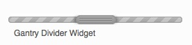

If you have placed 2 widgets in one position they will be displayed in one column in two rows (one above another), but if you're going to place between them a Gantry Divider Widget they'll be displayed in two columns (one next to each other) with widths set in the Layout settings of that position (for 2 widget columns variation). The below example shows the setup where 6 widgets will be displayed in six columns in one position.

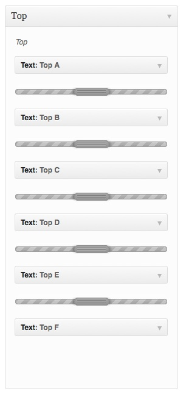

The same rule applies to the **MainBody** layout configuration - splitting your sidebar widgets with one Gantry Divider will result in breaking them into a two sidebar layout, exactly in the place where you placed your divider widget. A three sidebar layout is just a matter of adding a second Gantry Divider widget in the **sidebar** widget position.

Using Layouts
-------------
Each of the major widget positions is represented with a slider to allow for dynamic control over how widgets are laid out based on how many widgets are placed in that position. By default, the layout will be an equal size for the placed widgets.

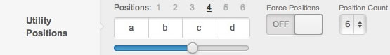

At the top of the slider are numbered links from 1 to 6 which represent the number of placed widgets you want to configure for. For example, if you are setting up the layout for a position which has 4 widgets in use splitted using 3 **Gantry Divider** widgets, you will want to first select the #4 link at the top of the slider for that position.

If you had 4 widgets in one position separated with the **Gantry Divider** widget that would mean your active positions would be 4. The layout slider will always show you the current number of placed widgets in that position. Below that number you see a block representation of the current layout.

We use a system based on [Twitter's Bootstrap](http://twitter.github.com/bootstrap/). The layouts are based 12, and by default the 12 column `3 | 3 | 3 | 3` of the default setting translates into an equal sized block for each of the 4 widgets you have placed in your position.

Based on the 12 column layout with 4 widgets of equal width published, the front-end will look like:

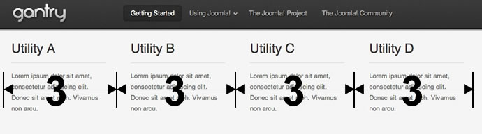

When you slide the slider bar below to select different widths for these 4 widget columns, a tooltip on the side will also show you the numeric value of the configuration.

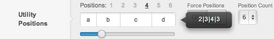

In this case you can see we have dragged the slider to the left and have chosen the layout `2 | 3 | 4 | 3`, which means that widget column **utility-a** is assigned `2` grids, **utility-b** is assigned `3`, **utility-c** is assigned `4` and **utility-d** is assigned `3` grids. After hitting Save this will cause the front-end's layout to change and display:

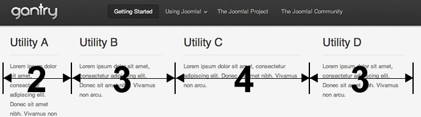

You can see the `2 | 3 | 4 | 3` proportions have been applied to the layout. Gantry is so flexible that you can configure different layouts for different numbers of placed widgets in a position. Gantry also has the ability to show different widgets on different overrides, so you may have 4 widgets placed on your Home page, but only 2 widgets placed on one of your internal pages, for example. To accommodate this you can merely click the 2 in the **Positions** list and choose a layout that suits your needs:

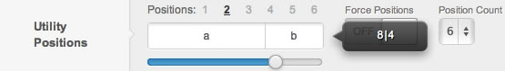

This will translate into a `8 | 4` or worded another way, a 2/3 and 1/3 distribution of the 2 widgets:

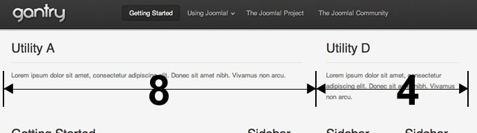

Mainbody Layouts
----------------
The layouts for the mainbody area is slightly different from the other widget layouts. The primary difference is that the mainbody is generally displayed along side up to 3 sidebars. This provides the ability for a Gantry-powered template to effectively support a 4 column layout. We researched a wide variety of sites and determined that more than 4 columns for a layout is very rare and quickly becomes unreadable due to the limited amount of space available. Generally speaking 2 or 3 columns is the preferred layout for a modern website.

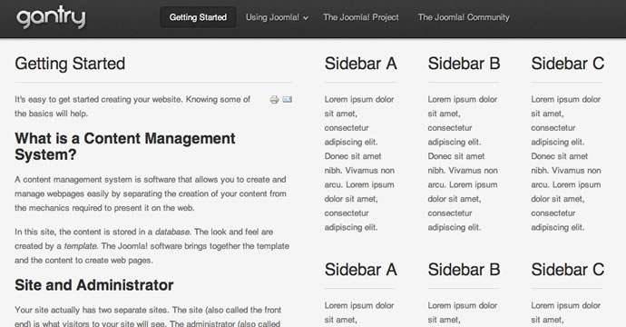

The layout for this is controlled in the template settings. As you can see below, Gantry understands that there are 3 sidebar columns (widgets in sidebars have been splitted using two Gantry Divider widgets), so when the mainbody is taken into account, this creates a 4 column layout. The current configuration is set to `6 | 2 | 2 | 2` where the mainbody is using 6 grid units, and the 3 sidebars each use 2. This adds up to the 12 grid system we are using in this example.

If you drag the slider to the right you will see the positions shuffle around giving different options for where the mainbody is displayed as well as various widths for each. With 4 total columns there is not much room to have widely varying column widths, so let's turn off one of the columns by removing one of the Gantry Divider widgets in the **sidebar** position using the WordPress widget manager. Below you will see how the default layout is currently set to display when we have only 2 sidebars :

As you can see it's set for the 2 sidebars to be displayed on the right each taking up 2 grid units, while the mainbody is on the left occupying 8 grid units. Dragging the slider to the right will provide a wide variety of layout options. As you can see below, this example shows a layout of `3 | 6 | 3`, where the mainbody is in the middle:

After click the Save button in the toolbar, you will be able to see this layout applied to the frontend:

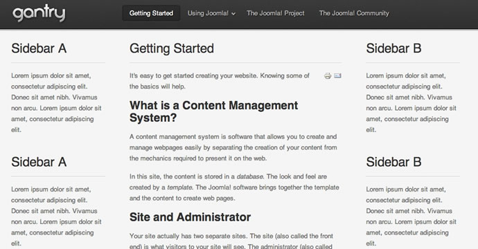
