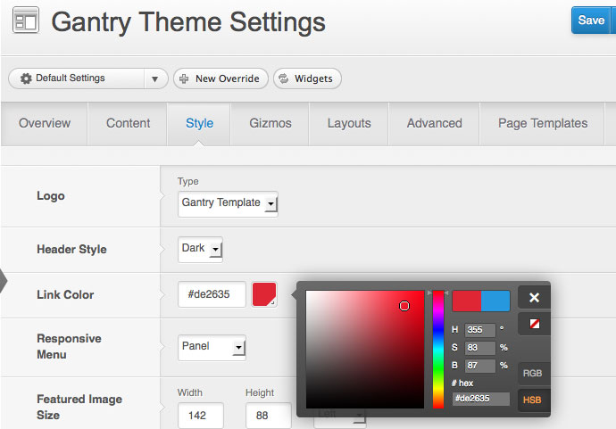
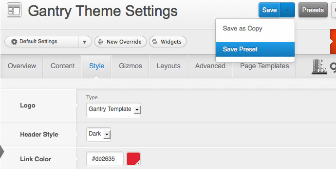
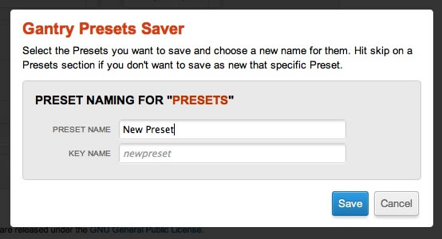
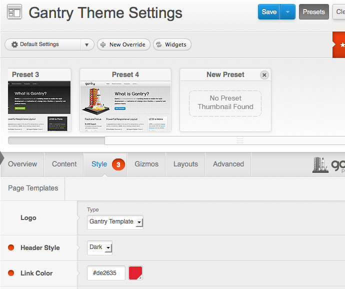

Presets
=======
Gantry makes use of a powerful preset system allowing developers and site builders to create preset styles and configurations.

> 
>
> Creating a custom preset is easy with Gantry. Check out this short video on how to customize your layout and create a custom preset based on your configuration options.

*Gantry Presets* is a combination of Gantry features and configuration settings which allow you to create predefined groupings for the entire template as well as on a per-override basis. Presets can consist of any Gantry configuration option, such as: CSS style, link color, background, body graphic levels, font settings, and much more.

Creating a new Preset
---------------------
To configure a new preset, go to **Admin Dashboard → Gantry Theme → Style**. From here, you can configure style settings for the template. In the example below, we'll change the link color.

Once configured, click **Save Preset** from the Save button dropdown.

The Gantry **Presets Saver** modal dialog box will appear. Enter your **Preset Name**, and the **Key Name** will be generated automatically. Then click **Save**.

Select your new Preset
----------------------
Click on the **Presets** button to display all available presets. Your new preset will display in the slider. Click on the preset to load your custom style settings. Select **Save** to load the preset.

After a preset is created, you can create a thumbnail image in the `admin/presets/` folder with the filename structure **keyname.png** where keyname is the Keyname from the modal dialog box.

