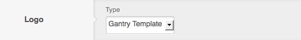
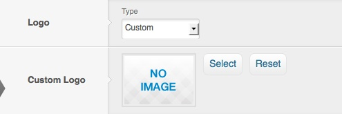
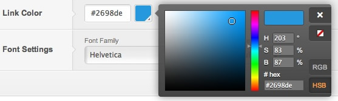
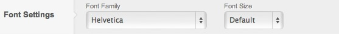
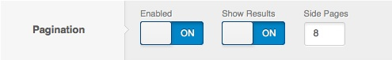
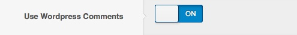
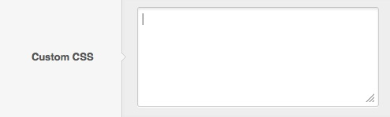

Style
=====
The **Style** panel in the Gantry based template administration interface provides several options for configuring the main stylistic aspects of the template. While the default Gantry template includes several options, you can easily add and configure many more based on your template's needs. The following configuration options are available by default:

Logo
----
The *Logo* setting provides the ability to change its type. The default setting is **Gantry Template**, which loads the included template logo.

The second logo type option is **Custom**. This will load the **Custom Logo** field, where you can **Select** an image through the *Media Manager*.

Link Color
----------
The *Link Color* setting provides the ability to easily change the main color for template links. Colors can be inputted via the color chooser pop-up selector. You can also do this manually using a hex code in the input field.

Font Settings
-------------
The *Font Settings* setting provides the ability to change the font size as well as the default font family used in the template. Many popular web fonts are included as options. Some templates also include additional custom font options.

Pagination
-------------------
The *Pagination Settings* setting allows you to decide how the pagination between content pages should look. This parameter allows you to decide if user should be able to see total number of pages, and how many side pages should be displayed next to the current page.

Use WordPress Comments
-------------------
The *Use WordPress Comments* setting gives you ability to disable the WordPress core comments on the front-end in case if you prefer to use a third-party solution.

Custom CSS
-------------------
The *Custom CSS* setting allows you to input your own, custom CSS code that will be added inline to the head section of the page. This way you can add custom styling (globally or per-override) to your page without modifying any of the template files.

