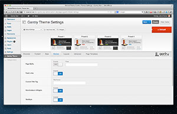

Custom Presets
==============
This section covers how to create a new custom preset in a Gantry enabled template.

> 
>
> Creating a custom preset is a very simple task with Gantry. Check out this short video on how to customize your layout then create a custom preset based on your configuration options.

Step 1: Preparing
-----------------
Gantry provides the ability for you to create your own custom presets based on any parameter in the template settings. You should determine which parameters you wish to configure to be a part of the presets. Write down their names as found in the templateDetails.xml file.

Step 2: Saving a Custom Preset
------------------------------
There are two types of presets. The first type of preset are the ones defined by the template itself. These are located in the `$gantry_presets` variable located in the **gantry.config.php** file.

~~~ .php
$gantry_presets = array(
    'presets' => array(
        'preset1' => array(
            'name' => 'Preset 1',
            'cssstyle' => 'style1',
            'linkcolor' => '#2698de',
            'font-family' => 's:helvetica'
    ),
        'preset2' => array(
            'name' => 'Preset 2',
            'cssstyle' => 'style2',
            'linkcolor' => '#ff0000',
            'font-family' => 's:helvetica'
    ),
    ...
~~~

This array contains a set of presets comprised of another array of parameters along with a special parameter called **name** which is the display name for this preset.

The second kind of preset is the custom preset that you can save from the template settings page. If you set a bunch of parameters in the administrator, you can click **Save Preset** from the Save button dropdown and save as **new preset**. This will save the same parameters as defined in the `$gantry_presets` variable. If you want to save new parameters, you will also need to add them to the `$gantry_presets` variable in order for them to be saved as a custom preset. If you save a custom preset Gantry will create a file called presets.ini in your `YOUR_SITE/wp-content/themes/YOUR_TEMPLATE/custom/` folder. In the example below, I saved a custom preset and chose the name "New Preset" in the popup dialog.

~~~ .ini
newpreset_name="New Preset"
newpreset_linkcolor="#db2c2c"
newpreset_font-family="s:helvetica"
~~~

Step 3: Creating a custom thumbnail
-----------------------------------
When you create a new custom preset, there is a default image used in the preset chooser to represent this. You can create your own thumbnail for each style by creating a png file that is the 'short' name of the preset with the dimensions of 180px x 100px. For example, for my custom preset above, I would just create a small thumbnail called **newpreset.png** and put this file in the `YOUR_SITE/wp-content/themes/YOUR_TEMPLATE/admin/presets/` folder.

Step 4: Adding To Gantry's Presets
----------------------------------
To transfer one of the custom presets into the core gantry config file, you just need to convert the values in the preset.ini file into the array format as used in the `gantry.config.php` file. I've added this custom preset portion to the bottom of the array in the file:

~~~ .php
...
'preset2' => array(
    'name' => 'Preset 1',
    'cssstyle' => 'style1',
    'linkcolor' => '#2698de',
    'font-family' => 's:helvetica'
),
'newpreset' => array(
    'name' => 'New Preset',
    'cssstyle' => 'style2',
    'linkcolor' => '#db2c2c',
    'font-family' => 's:helvetica'
),
...
~~~
