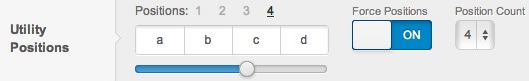
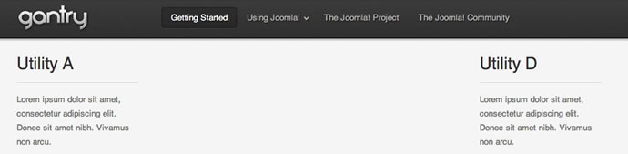

Using Force Positions
=====================
There are times when you just don't want to have your widgets taking up all the room in a position no matter what the layout. For example you might want to have a widget on the left and a widget on the right, with nothing in the middle. In traditional WordPress templates you would have to resort to making two specific widget positions and using CSS, position them on the left and right sides of your design.

> 
>
> Forcing the widget positions is a powerful layout control. This short screencast provides some insight in how to achieve this and also the layout control that can be attained using this technique.

With Gantry however, you can use the layouts settings to achieve this goal with no code or special CSS. First in the layouts settings, for the **Utility Positions**, set the **Force Positions** to **On** and then set the **Position Count** to 4.

This means that there will always be 4 utility widgets placed in the position (**utility-a**, **utility-b**, **utility-c**, **utility-d**) displayed no matter how many widgets you actually have placed in the widget position. Then all you need to do is place a widget in the **utility-a** position to show on the left, a widget in **utility-d** to show on the right. Please note that you still need to use 3 **Gantry Divider** widgets in that position, but thanks to this option you don't need to have normal widgets between them.

Enter the **Layouts** section and toggle on the **Force Positions** for the widget position you are utilizing.

And the end result will be:

