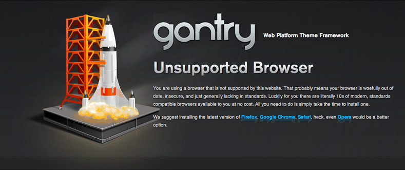

Creating an Unsupported Page
============================
This tutorial will take you through the steps needed to create an unsupported browser page functionality as used here on gantry-framework.org. You can see what this looks like by pointing your browser to: <http://www.gantry-framework.org/?tmpl=unsupported>. Users of unsupported browsers (IE6 and IE7) are automatically taken to this page whenever they try to access a page on gantry-framework.org.

Step 1: Unsupported Browser Redirect Feature
--------------------------------------------
The logic for this Unsupported Browser page is powered by a custom gizmo that we've called **unsupportedredirect.php** in this instance. This is a custom gizmo that we create and drop into the template's `gizmos/` folder. The code is very simple as you can see below:

~~~ .php
<?php
/**
 * @version   ${project.version} ${build_date}
 * @author    RocketTheme http://www.rockettheme.com
 * @copyright Copyright (C) 2007 - ${copyright_year} RocketTheme, LLC
 * @license   http://www.gnu.org/licenses/gpl-2.0.html GNU/GPLv2 only
 */

defined('GANTRY_VERSION') or die();

gantry_import('core.gantrygizmo');

/**
 * @package     gantry
 * @subpackage  features
 */
class GantryGizmoUnsupportedRedirect extends GantryGizmo {

    var $_name = 'unsupportedredirect';

    function isEnabled() {
        return true;
    }

    function init() {
        
        global $gantry;
        
        $request = basename($_SERVER['REQUEST_URI']);
        
        if ($request != 'unsupported.php' && $gantry->browser->name == 'ie' && ($gantry->browser->shortversion == '6' || $gantry->browser->shortversion == '7')) { 
            add_filter('template_include', array(&$this, 'unsupported_redirect'));     
        }

    }
    
    static function unsupported_redirect($template) {
        return locate_template(array('unsupported.php'));
    }
    
}
~~~

The feature is actually very simple, but let's break it down into parts so you can get a feel for how it works:

#### isEnabled()

The `isEnabled()` method is set to true because we are effectively forcing this gizmo to be enabled. We don't need any user interaction to toggle this functionality although that could easily be added by adding a simple bit of XML in the **templateDetails.xml** if needed.

#### init()

This is where the logic actually happens. The init() method is the better place for any non-rendering functionality and as you can see here, there is just a simple `if` statement to ensure that we are not already on the unsupported page, the viewing browser is `ie`, and the short version is `6` or `7`. This ensure that only IE6 and IE7 browsers will enter the `if` statement, and load the **unsupported.php** page.

Step 2: Unsupported tmpl file
-----------------------------
As you saw at the end of Step 1, we've redirected IE6 and IE7 users to **unsupported.php**, but what does this mean? We are going to filter out the template_include WordPress filter and load our own file when browser conditions are met. By default, WordPress looks for index.php inside your template folder, however if we are going to use the mentioned previously filter, we can override this behavior, forcing WordPress to load different php file.

The unsupported.php is basically a stripped down version of our existing index.php file as you can see below:

~~~ .php
<?php
/**
 * @version   ${project.version} ${build_date}
 * @author    RocketTheme http://www.rockettheme.com
 * @copyright Copyright (C) 2007 - ${copyright_year} RocketTheme, LLC
 * @license   http://www.gnu.org/licenses/gpl-2.0.html GNU/GPLv2 only
 */
// no direct access
defined('ABSPATH') or die('Restricted access');
?>
<!doctype html>
<html xml:lang="<?php echo $gantry->language; ?>" lang="<?php echo $gantry->language;?>" >
<head>
    <meta name="viewport" content="width=device-width, initial-scale=1.0">
    <?php
        $gantry->displayHead();
        $gantry->addLess('global.less', 'master.css');
    ?>
</head>

    

        

            

                

                    

                        

                            

                                

                                    

                                        

                                            
                                        

                                        

                                            <h1>
                                                Gantry <small>Web Platform Theme Framework</small>
                                            </h1>
                                            <h1>
                                                <b>Unsupported Browser</b>
                                            </h1>
                                            

                                                You are using a browser that is not supported by this website. That probably means your browser is woefully out of date, insecure, and just generally lacking in standards. Luckily for you there are literally 10s of modern, standards compatible browsers available to you at no cost. All you need to do is simply take the time to install one.
                                            

                                            

                                                We suggest installing the latest version of <a href="http://www.mozilla.com/en-US/firefox/firefox.html">Firefox</a>, <a href="http://www.google.com/chrome">Google Chrome</a>, <a href="http://www.apple.com/safari/download/">Safari</a>, heck, even <a href="http://www.opera.com/">Opera</a> would be a better option.
                                            

                                        

                                    

                                

                            

                        

                    

                

                

            

        

    

</html>
<?php
$gantry->finalize();
?>
~~~

Basically we've removed all the extraneous widget calls, and left the page in a basic hard-coded state. You could of course keep some of the widget positions if needed, but we opted for the simple approach and kept the output as basic as possible while still offering the feel of the regular gantry-framework.org site.

Step 3: Tweaking and Testing
----------------------------
At this point you should have a fully functional gizmo. You should tweak and optimize this output to suit your needs. We kept ours pretty similar to our regular page, and even included our regular template.css and wordpress.css files, but we also added a new unsupported.css file that has some styling that is only needed on this page. You can see these in the `addStyles()` method in the unsupported.php file listed above.

After you are pretty happy with the way this looks the last step is to actually test and fix it so that it looks correct in IE6 an IE7. You should be able to point your IE6 or IE7 browser directly at your site: **http://YOUR_SITE** and it should redirect you automatically to the unsupported page you have been working on. Just tweak and adjust your css as needed to ensure that things look correct in IE6, as this is the only browser that really sees the page.

That's it! Pretty easy right?
