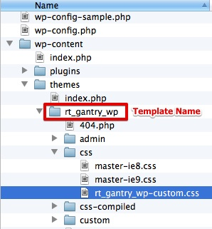
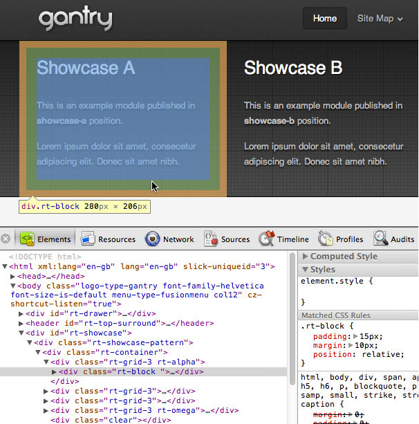
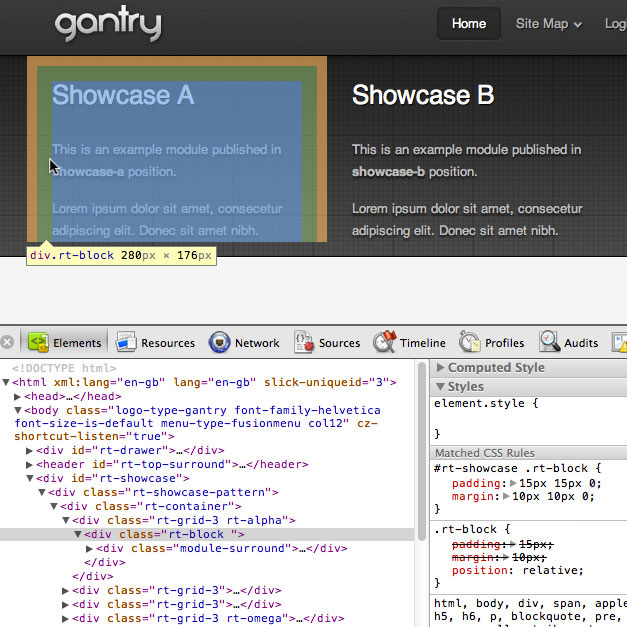
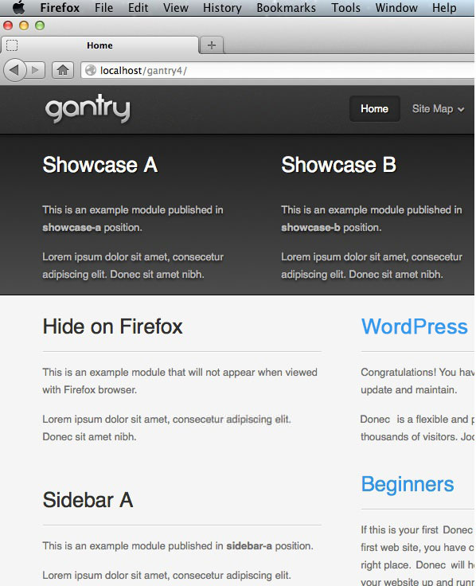
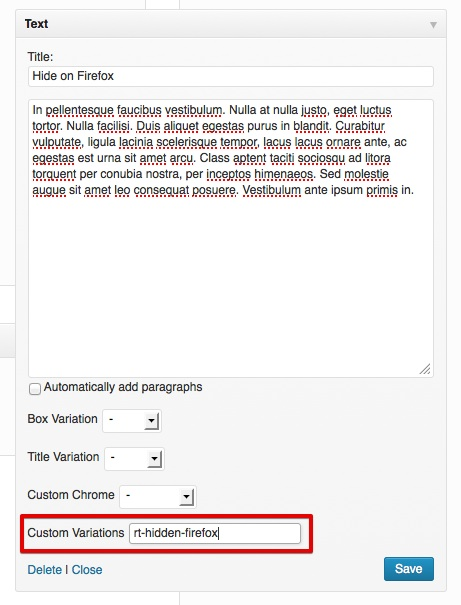
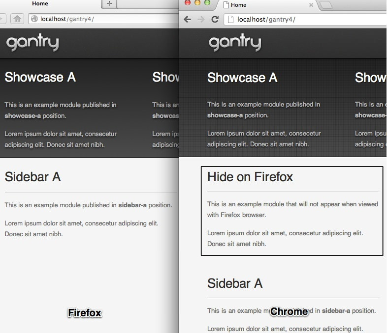
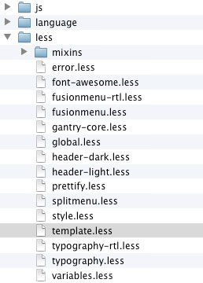
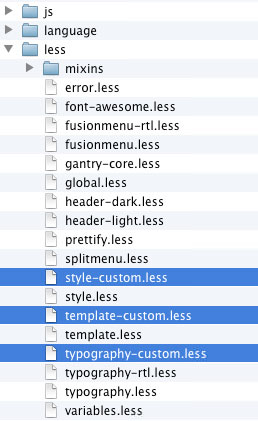

Adding a Custom Stylesheet
==========================
This tutorial will take you through the steps needed to add a custom stylesheet to your Gantry template without worrying about lost changes when either the template or Gantry framework is updated. You won't need to change any of the template files, so your custom stylesheet will not be overridden by updates.

Custom Stylesheet with CSS
--------------------------
The Gantry template comes complete with structured CSS rules and properties which are compiled from LESS files. There are, however, some cases where we need to style the template without using LESS. One of the ways to do this involves using the custom CSS file with custom rules and properties to override a particular style in the template.

Step 1: Adding Your Custom CSS File
-----------------------------------
To create a custom CSS file, you'll need to create a new CSS file at `/wp-content/themes/[TEMPLATE]/css/`, and name it **[TEMPLATE]-custom.css**. The new custom CSS file will automatically be loaded by *Gantry Framework*.

Step 2: Adding Your Custom Rules and Properties
-----------------------------------------------
You should be able to add the custom rules and properties inside the **[TEMPLATE]-custom.css** file in order to customize your Gantry template. If you want to override any existing rules from the template, you can do so using CSS Specificity.

We'll go into more detail about this process below.

Example 1: Override Existing Rules
----------------------------------
In this example, we'll explain how to reduce the bottom padding and margin in the **showcase** position of the **default gantry template**, which inherits rules from the `rt-block` element inside `rt-showcase`.

With *Chrome Developer Tools*, we can see that the default margin and padding are:

~~~ .css
.rt-block {padding: 15px; margin: 10px; position: relative;}
~~~

If we want to override the bottom padding and margin, we **can not** just put the same rule and change the padding or bottom value. Here's an example:

~~~ .css
.rt-block {padding: 15px 15px 0; margin: 10px 10px 0;}
~~~

There are many elements in the template that utilize `rt-block`, and these custom rules will affect them. It's also possible that the custom rule will not work at all if your custom CSS file is loaded before the template CSS file, which contains the existing rule.

Hence, we need to put the rule with more specific selectors. We need to create a blank file `css/rt_gantry_wp-custom.css`. Since `rt-block` is wrapped inside `rt-showcase`, we can put the following rule inside `css/rt_gantry_wp-custom.css`.

~~~ .css
#rt-showcase .rt-block {padding: 15px 15px 0; margin: 10px 10px 0;}
~~~

Now, we can check the result with the **Developer Tools** again to confirm that our custom rule overrides the existing one.

Example 2: Per-Browser Specific Custom Stylesheet
-------------------------------------------------
*Gantry Framework* has the ability to load specific CSS file based on which browser and operating system is viewing the template. This ability can be also applied to our custom CSS file. You just need to create a new CSS file at `/wp-content/themes/[TEMPLATE]/css/` and name it `[TEMPLATE]-custom-[BROWSER].css`. Please check the [Per-Browser Specific Control](../advanced/per_browser_control.md) page for possible name combinations.

In this example, we will explain how to hide a specific widget viewed with Firefox, while keeping it visible on other browsers. In the case of the **gantry default template**, we need to create `/wp-content/themes/[TEMPLATE]/css/rt_gantry_wp-custom-firefox.css`.

Next, we need to put the custom rule inside `/wp-content/themes/[TEMPLATE]/css/rt_gantry_wp-custom-firefox.css`.

Here's an example:

~~~ .css
.rt-hidden-firefox {display: none;}
~~~

Now, we can put `rt-hidden-firefox` in the **Custom Variations** of the widget we want to hide on Firefox.

Click the **Save** button before confirming the result in Firefox, as well as other browsers. The widget should be successfully hidden on Firefox, and remain visible on other browsers.

**Per-Browser Specific Custom Stylesheet** is not just limited to showing or hiding a specific widget. We can also use this ability, for example, to create a new rule or override existing rules just for specific browser, such as Internet Explorer. Any in CSS can be overridden on a per-browser basis using this method.

Custom Stylesheet with LESS
---------------------------
Another way to add the custom style to the Gantry template is to create a custom LESS file inside `/wp-content/themes/[TEMPLATE]/less`. The custom LESS file name should be formatted as `[LESS_FILE_NAME]-custom.less`. This file will be compiled in the main CSS file.

For example, in the default Gantry template, there is a file called `less/template.less`. We can add a custom LESS file named `less/template-custom.less` and add our custom LESS elements. Gantry will pick up the elements and compile it. You may also use other file names such as `less/style-custom.less`, `less/typography-custom.less`, and so on.

The only limitation with Custom LESS file is that we **can not** use **Per-Browser Specific Custom Stylesheet**. Such is the case with `less/template-custom-firefox.less`. If you need to control some elements on specific browsers, we need to use the Custom CSS file as described previously.
